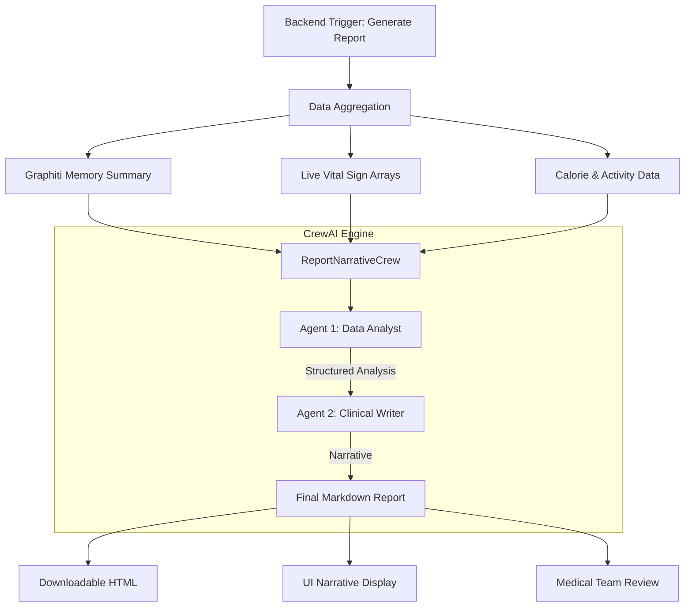
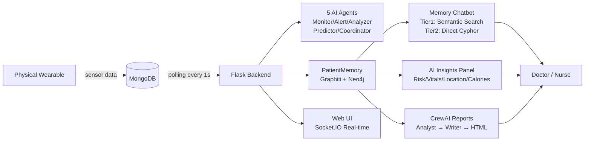

# UTLMediCore Weekly System Evolution Update
## 📅 Period: March 7, 2026 – March 14, 2026

> **Status**: Weekly Technical Narrative & System Architecture Overview  
> **Core Focus**: Neo-Brutalist UI · CrewAI Multi-Agent Reporting · Calorie Tracking · Memory Optimization  

This document summarizes the significant leaps made in the UTLMediCore system over the past week. We have transitioned from a functional Glassmorphic interface to a high-impact **Neo-Brutalist** design, implemented a **Multi-Agent Collaborative Engine (CrewAI)** for professional medical narrative generation, and successfully integrated **real-time calorie tracking** into the persistent memory system.

---

## 1. The "Neo-Brutalist" UI Evolution
*From Professional Glassmorphism to High-Performance Medical Aesthetics.*

### **Visual Philosophy**
The new interface (`agentic_interface_enhanced.html`) moves away from generic "soft" designs towards a **Neo-Brutalist** approach. This style uses high-contrast elements, heavy geometric shadows, and a vibrant color-coded system to ensure critical medical data is impossible to miss.

### **Key UI Enhancements**
| Feature | Implementation Detail | Benefit |
| :--- | :--- | :--- |
| **Brutalist Shadows** | `shadow-[4px_4px_0px_0px_rgba(51,57,74,1)]` | Creates a tactile, physical "card" feel that separates information tiers clearly. |
| **Hybrid Typography** | `Inter`, `DM Mono (JetBrains Mono)` via Google Fonts | Combines modern tech-sans with monospace for a premium, authoritative look. |
| **Dynamic Data Viz** | SVG animated activity rings & HR bar charts | Provides instant visual feedback on patient vitality trends without reading text. |
| **Mobile-First UX** | Fixed `backdrop-blur` navigation & `visualViewport` keyboard handling | Ensures nurses can use the system efficiently on mobile tablets during ward rounds. |
| **Model Selector Badges** | Dropdown with 🖥 Local / ☁ Ollama Cloud / ☁ OpenAI Cloud badges | Users can switch the AI "brain" on-the-fly without restarting the system. |
| **Floating Memory Chat** | Dedicated chat overlay with model selector & memory badge | Doctors/nurses can converse with the patient's full history from any page. |
| **Calories Burned Widget** | Dedicated card with 🔥 icon, KCAL display | Real-time energy expenditure always visible on patient card. |

---

## 2. CrewAI: Multi-Agent Clinical Reporting
*From Simple Templates to Intelligent Medical Narratives.*

We have integrated **CrewAI** into the `insights/report_crew.py` module. This framework allows multiple specialized AI agents to collaborate on a patient's data before writing the final report.

### **The Reporting Workflow (The "Crew")**
The system spins up a tactical crew consisting of two specialized agents:

1.  **The Healthcare Data Analyst**:
    *   **Task**: Ingests raw JSON data (Vitals, Locations, Alerts, Graphiti Memory).
    *   **Goal**: Identify anomalies, trend regressions, and positive health patterns.
    *   **Output**: A structured technical analysis of the period's data.

2.  **The Clinical Report Writer**:
    *   **Task**: Receives the analysis from the Data Analyst.
    *   **Goal**: Translate technical findings into a professional, compassionate medical narrative.
    *   **Output**: A Markdown-formatted report suitable for clinical records.

### **System Architecture (CrewAI Implementation)**


### **Why this is "Smart":**
*   **Chain of Thought**: By separating "Analysis" from "Writing," we reduce hallucinations. The Analyst focuses on the data math, and the Writer focuses on the professional tone.
*   **Model Agnostic**: Uses `ollamacloud:kimi-k2-thinking` for deep reasoning while retaining local `lfm2.5-thinking` as a backup.
*   **Resiliency**: If the autonomous "Crew" fails to reach consensus, the system triggers a `_fallback_narrative` to guarantee 100% uptime for medical documentation.

---

## 3. Advanced Memory Reasoning (Graphiti + Temporal)
*Solving the "When did this happen?" problem.*

The system now features **Temporal-Aware Retrieval with Two-Tier Fallback**.

*   **The Problem**: Standard RAG (Retrieval Augmented Generation) often misses the timing. If a patient falls at 10:00 AM, a standard search might retrieve vitals from 10:00 PM.
*   **The Solution (Tier 1)**: We implemented a **Regex-based Time Trigger**. If the system detects a time-relative query (e.g., "What was her heart rate this morning?"), it bypasses semantic vector search and uses a specific **Cypher query** to pull nodes within a precise `±45 minute` window of that timestamp.
*   **The Fallback (Tier 2)**: If Graphiti's Tier 1 semantic search fails or is busy, a **lock-free direct Cypher query** fetches the 10 most recent episodes directly from Neo4j in milliseconds — no Ollama dependency required.

---

## 4. Calorie & Metabolic Tracking Integration (New This Week)
*Connecting real device data to AI reasoning.*

### **Problem Discovered & Fixed**
The physical wearable device sends calorie data via MongoDB using the field name `Calories` (representing kcal burned by the pedometer). The system was incorrectly treating this as food *intake*, resulting in `burned = 0` in all AI memory — the AI had no calorie knowledge.

**Root Cause Fix in `memory/patient_memory.py`:**
```python
# BEFORE (incorrect):
calories = data.get("Calories")  # → treated as food intake (WRONG)
burned = data.get("Calories_burned", 0)  # → always 0 (field doesn't exist)

# AFTER (correct):
has_explicit_burned_field = "Calories_burned" in data or "calories_burned" in data
if not has_explicit_burned_field and calories > 0:
    burned = calories  # Device: 'Calories' = energy expenditure from movement
    calories = 0       # No food intake data available from wearable
```

### **Calorie Data Now In Persistent Memory**
Every AI memory episode now includes nutritional context:
```
"Nutritional Status: Energy Expenditure: 298 Kcal burned (Intake data not logged/manual)."
```

*   **AI Chat**: Can now accurately answer "How many calories has the patient burned?"
*   **AI Insights**: Correlates calorie data with activity patterns and vital signs.
*   **CrewAI Reports**: Includes a "Nutritional Analysis" section with metabolic status.

---

## 5. Cloud AI Model Cleanup
*Retaining only confirmed working models.*

### **Models Removed** (unreliable / causing UI clutter)
| Model | Reason |
| :--- | :--- |
| `gpt-oss:120b` | High error rate, not reliable for clinical use |
| `deepseek-v3.2` (×2 duplicates) | Frequent timeouts, auto-fetched duplicates |
| `deepseek-v3.1:671b` | Auto-fetched duplicate, causing dropdown clutter |

### **Models Confirmed & Active**
| Model | Parameters | Role |
| :--- | :--- | :--- |
| `kimi-k2-thinking` ⭐ Default | ~1T | Deep multi-step clinical reasoning |
| `mistral-large-3:675b` | 675B | Comprehensive clinical analysis |
| `glm4.7` 🆕 | — | Coding, agentic tasks, multilingual |

---

## 6. Memory Responsiveness Improvement

The Graph Memory storage threshold was reduced from **every 50 data points** to **every 10 data points**, making the AI memory 5x more responsive to recent sensor changes.

```python
# BEFORE: AI memory updated every ~50 seconds
if is_notable or len(self.history) % 50 == 0:

# AFTER: AI memory updated every ~10 seconds
if is_notable or len(self.history) % 10 == 0:
```

This ensures the AI chat sees recent calorie and activity data within seconds, not minutes.

---

## 7. System Architecture Snapshot (as of March 14, 2026)



---

> **Document Generated on**: 2026-03-14  
> **System Version**: UTLMediCore v2.1 — Calorie-Enabled Build  
> **For full technical walkthrough**: See `UTLMediCore_Weekly_Report_Week2_March2026.md`  
