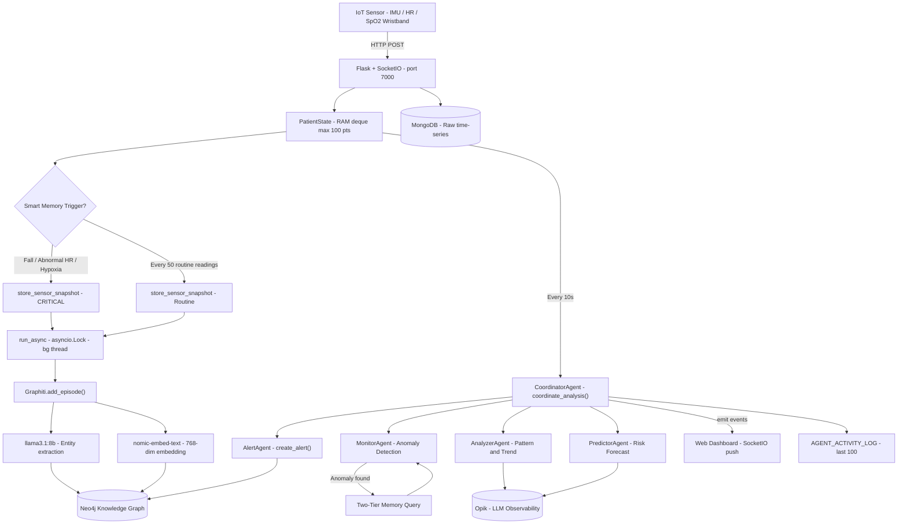
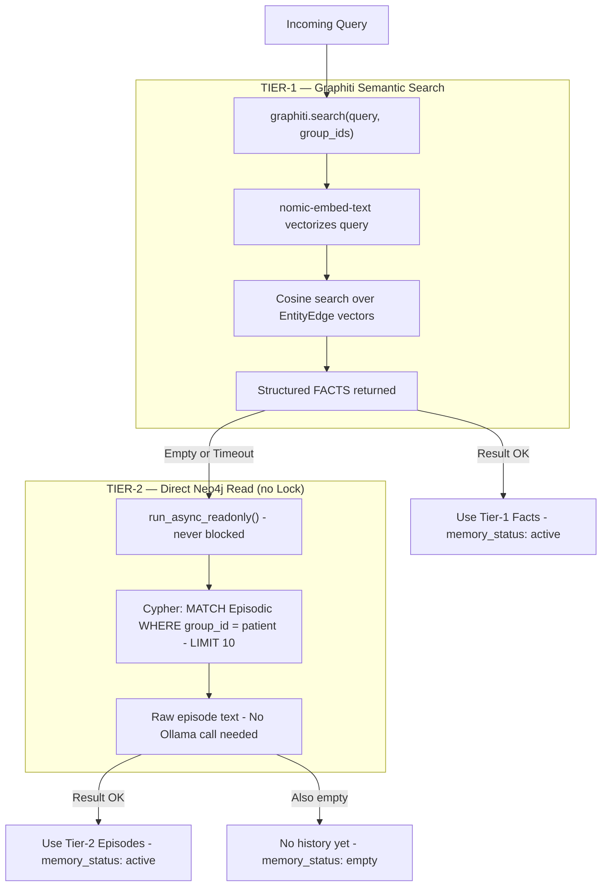
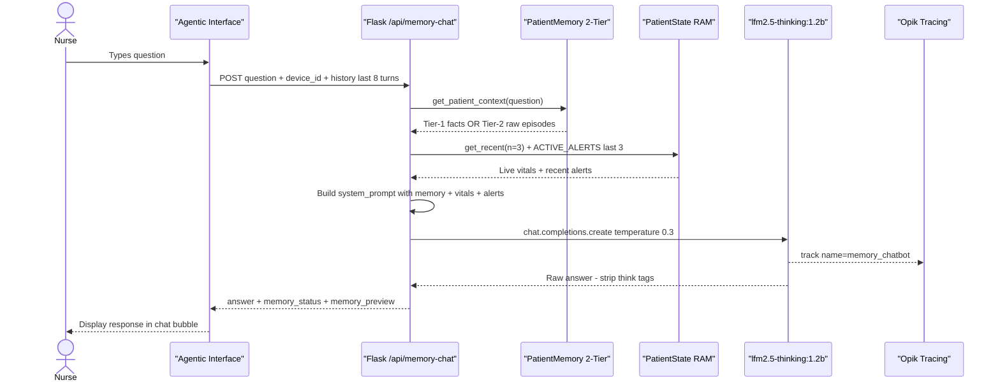
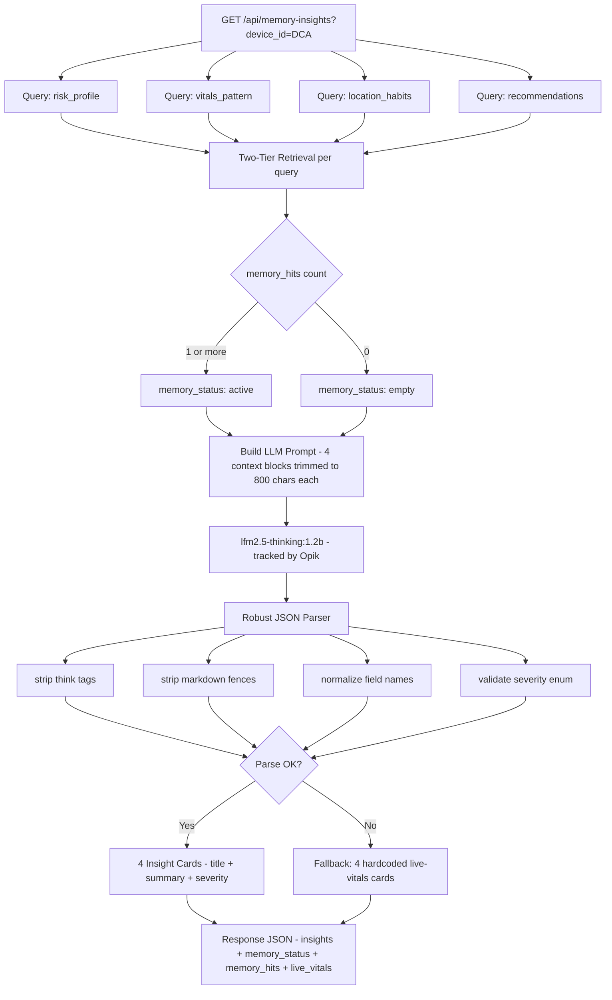
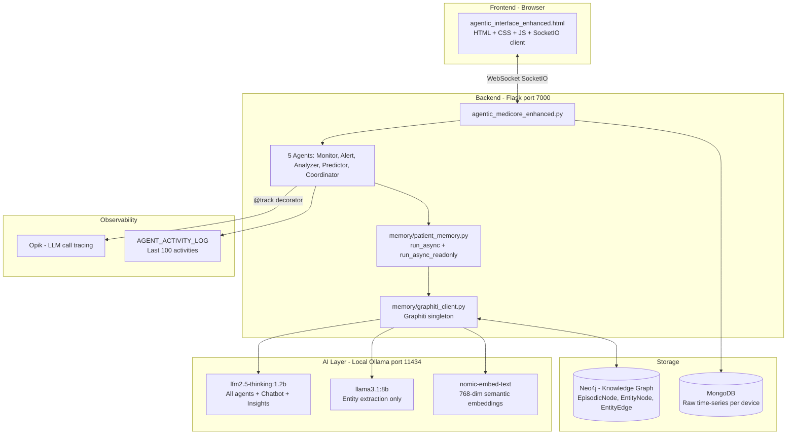

# UTLMediCore — System Workflow Diagrams

## 1. End-to-End Data & Agent Pipeline

---

## 2. Two-Tier Memory Retrieval Strategy

---

## 3. AI Chatbot Request Lifecycle — /api/memory-chat

---

## 4. AI Insight Cards — /api/memory-insights

---

## 5. Technology Stack Overview

---

*UTLMediCore — Multi-Agent Patient Monitoring System*
*Architecture as of March 2026*
